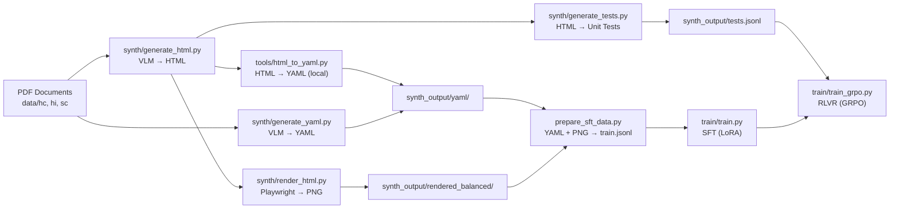

# olmOCR Project Status

> **Last updated:** 2026-03-03 11:34 IST  
> **Objective:** Fine-tune Qwen2.5-VL-7B for OCR on Indian Supreme Court legal documents using synthetic data generated from the OLMoCR approach.

---

## Architecture Overview



---

## Project Structure

```
olmOCR/
├── main.py                     # Original CLI entry point (GPT-4o based)
├── prepare_sft_data.py         # Builds SFT train.jsonl from HTML or YAML outputs
├── .env                        # OPENROUTER_API_KEY
│
├── synth/                      # ★ MAIN USE CASE — Synthetic data generation
│   ├── generate_html.py        # PDF → HTML via VLM (905 lines)
│   ├── generate_yaml.py        # PDF → YAML via VLM (883 lines)
│   ├── render_html.py          # HTML → PNG/PDF via Playwright
│   ├── generate_tests.py       # HTML → unit tests JSONL
│   ├── evaluate_tests.py       # Evaluate OCR text against tests
│   └── run_pipeline.py         # End-to-end orchestrator (HTML → render → tests)
│
├── src/                        # Core library (used by synth/)
│   ├── anchor.py               # Extract anchor text from PDF digital layer
│   ├── api.py                  # API call helpers
│   ├── render.py               # PDF → base64 PNG rendering
│   ├── pipeline.py             # Original OCR pipeline
│   ├── prompt.py               # Prompt templates
│   └── models.py               # Model definitions
│
├── train/                      # Model training
│   ├── train.py                # SFT (LoRA/QLoRA) on Qwen2.5-VL-7B
│   ├── train_grpo.py           # GRPO reinforcement learning
│   ├── rlvr_dataset.py         # Dataset class for RLVR
│   └── rewards.py              # Reward functions (binary/proportional/weighted)
│
├── scripts/                    # Data preparation utilities
│   ├── create_balanced_dataset.py
│   ├── select_sc_sample.py
│   └── postprocess_for_translation.py
│
├── tools/                      # Converters & monitoring
│   ├── html_to_yaml.py         # HTML → YAML (no API, local)
│   ├── yaml_to_html.py         # YAML → HTML (for previewing)
│   └── yaml_stats.py           # Session speed, ETA, folder coverage
│
├── tests/                      # Integration tests
│   └── test_pipeline.py
│
├── data/                       # Source PDFs
│   ├── hc/                     # High Court (digital PDFs)
│   ├── hi/                     # Hindi (digital PDFs)
│   └── sc/                     # Supreme Court (scanned PDFs)
│
└── synth_output/               # All generated outputs
    ├── html/                   # 7,228 HTML files
    ├── html_balanced/          # 4,218 balanced subset (symlinks)
    ├── rendered_balanced/      # 4,218 PNG screenshots
    ├── yaml/                   # 21,493 YAML files (and growing)
    ├── tests.jsonl             # 33,704 unit tests
    └── logs/                   # Progress & error logs
```

---

## Data Pipeline Status

### Source Data (PDFs)

| Folder | Content | Type | Total Pages |
|--------|---------|------|-------------|
| `hc/` | High Court judgments | Digital (has embedded text) | 7,992 |
| `hi/` | Hindi judgments | Digital (has embedded text) | 1,408 |
| `sc/` | Supreme Court judgments | Scanned (image only) | 28,249 |
| **Total** | | | **37,649** |

### Generation Progress

| Pipeline | Source | Output | Count | Status |
|----------|--------|--------|-------|--------|
| [generate_html](file:///home/soumyajit-ghosh/Projects/Work/olmOCR/synth/generate_html.py#376-477) | hc, hi, sc | `synth_output/html/` | 7,228 HTMLs | ✅ Complete |
| `render_html` | html_balanced | `synth_output/rendered_balanced/` | 4,218 PNGs | ✅ Complete |
| `generate_tests` | html_balanced | `synth_output/tests.jsonl` | 33,704 tests | ✅ Complete |
| `generate_yaml` | hc, hi, sc | `synth_output/yaml/` | 21,493 YAMLs | 🔄 **In progress** |

### YAML Coverage (as of 2026-03-03 11:30 IST)

| Folder | Total Pages | YAMLs Done | Remaining | Coverage |
|--------|-------------|------------|-----------|----------|
| hc | 7,992 | 7,966 | 26 | **99.7%** |
| hi | 1,408 | 1,408 | 0 | **100.0%** |
| sc | 28,249 | ~12,100 | ~16,150 | **42.9%** |
| **Total** | **37,649** | **~21,500** | **~16,150** | **57.1%** |

> [!IMPORTANT]
> YAML generation running at **~165 pages/hr**. ETA for sc completion: **~4 days** (targeting ~March 7).

### Quality Metrics (from test evaluation)

| Test Type | Score | Notes |
|-----------|-------|-------|
| formatting | **100.0%** | All markdown formatting preserved |
| text_absence | **98.9%** | Headers/footers correctly excluded |
| table | **89.3%** | Table cell extraction solid |
| text_presence (fuzzy) | **89.7%** | Main OCR accuracy |
| order | **59.7%** | Reading order — inherent VLM limitation |
| **Overall (estimated)** | **~83–84%** | |

---

## Training Pipeline (Not Yet Started)

### Phase 1: SFT (Supervised Fine-Tuning)
- **Script:** [train.py](file:///home/soumyajit-ghosh/Projects/Work/olmOCR/train/train.py)
- **Model:** Qwen2.5-VL-7B-Instruct with LoRA/QLoRA
- **Input:** `train.jsonl` (built by `prepare_sft_data.py` from YAML + rendered PNGs)
- **Goal:** Teach the model OCR in YAML format for legal documents

### Phase 2: RLVR (Reinforcement Learning with Verifiable Rewards)
- **Script:** [train_grpo.py](file:///home/soumyajit-ghosh/Projects/Work/olmOCR/train/train_grpo.py)
- **Reward:** [rewards.py](file:///home/soumyajit-ghosh/Projects/Work/olmOCR/train/rewards.py) — proportional/weighted test pass rate
- **Dataset:** [rlvr_dataset.py](file:///home/soumyajit-ghosh/Projects/Work/olmOCR/train/rlvr_dataset.py) — renders + tests
- **Goal:** Optimize for verifiable OCR accuracy using automated test feedback

---

## API Configuration

| Setting | Value |
|---------|-------|
| Provider | OpenRouter → Alibaba (free tier) |
| Model | `qwen/qwen3-vl-235b-a22b-thinking` |
| Max tokens | 8,192 (YAML), 16,000 (HTML) |
| Temperature | 0.1 (YAML), 0.2 (HTML) |
| Wall-clock timeout | 240s per attempt, 3 retries |
| Provider fallbacks | Disabled (`allow_fallbacks: False`) |
| Thinking mode | Disabled via `/no_think` prefix |
| Workers | 4 PDF workers × 2 page workers |

---

## Remaining Tasks

- [ ] Complete sc YAML generation (~16,150 pages, ~4 days)
- [ ] Re-run failed pages (47 failures in current logs)
- [ ] Run `html_to_yaml.py` to fill any HTML→YAML gaps
- [ ] Build full `train.jsonl` via `prepare_sft_data.py from_yaml`
- [ ] Run SFT training (`train/train.py`)
- [ ] Run GRPO training (`train/train_grpo.py`)
- [ ] Evaluate fine-tuned model against `tests.jsonl`
